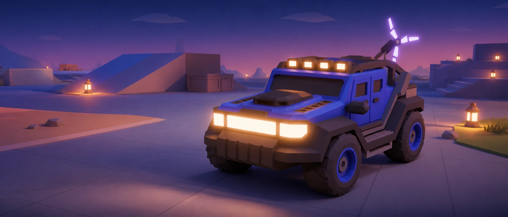
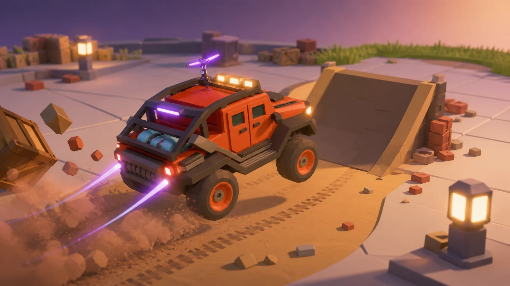
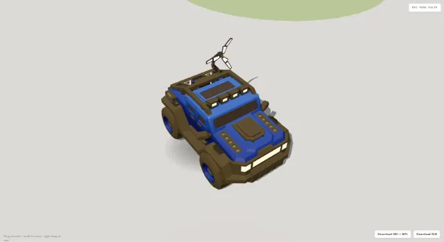
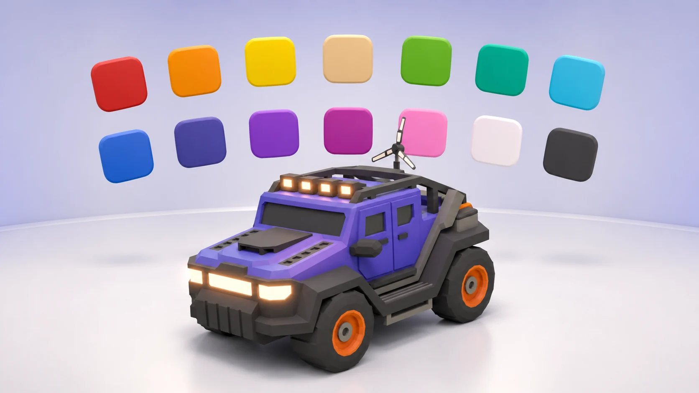
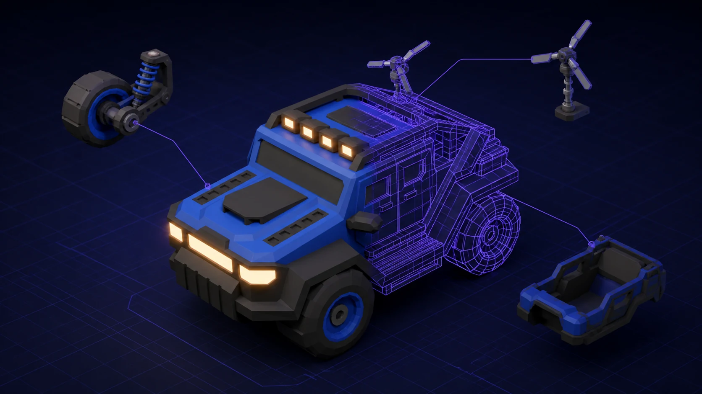
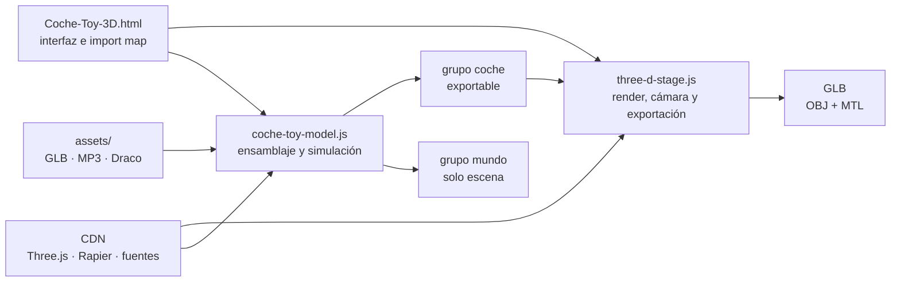

<p align="center">
  
</p>

<h1 align="center">Coche 4×4 · Laboratorio 3D</h1>

<p align="center">
  <strong>Inspecciona. Personaliza. Conduce. Exporta.</strong><br>
  Un pequeño laboratorio WebGL alrededor de un 4×4 de juguete con física real.
</p>

<p align="center">
  <a href="#puesta-en-marcha">Puesta en marcha</a> ·
  <a href="#controles">Controles</a> ·
  <a href="#exportación">Exportación</a> ·
  <a href="#arquitectura">Arquitectura</a> ·
  <a href="#contribuir">Contribuir</a>
</p>

<p align="center">
  <a href="https://threejs.org/"></a>
  <a href="https://rapier.rs/"></a>
  <a href="https://developer.mozilla.org/docs/Web/API/WebGL_API"></a>
  
  
</p>

<p align="center"><sub>Render editorial creado para el proyecto a partir de sus modelos 3D. No es una captura de gameplay.</sub></p>

---

Este repositorio convierte los modelos GLB de
[`folio-2025`](https://github.com/brunosimon/folio-2025) en una experiencia
web interactiva: puedes examinar el vehículo, probar acabados, conducir por un
recinto físico y descargar el modelo desde el navegador. El visor está escrito
en HTML y JavaScript nativos; no necesita compilación, backend ni dependencias
instaladas en la raíz del proyecto.

## Un coche, tres experiencias

| Modo | Qué ocurre |
|---|---|
| **Inspección** | Órbita, zoom, desplazamiento, autorrotación, cuatro encuadres, fondo claro/oscuro y vista de malla. |
| **Movimiento** | Ruedas, dirección, suspensión, luces, celdas de energía y antena se animan proceduralmente. |
| **Conducción** | Entra en escena Rapier: suspensión por rayos, rampas, distintos agarres, objetos dinámicos y cámara de seguimiento. |

<p align="center">
  
</p>
<p align="center"><sub>Concepto visual del modo Conducción, basado en los objetos y efectos disponibles en el visor.</sub></p>

El circuito combina cuatro rampas, dos zonas de agarre, seis faroles y diez
obstáculos dinámicos construidos con cajas, bancos y ladrillos del proyecto
original. La conducción añade derrape, freno de mano, salto, boost, polvo,
huellas, estelas, luces reactivas, sonido opcional y recuperación automática
del vehículo.

<details>
<summary><strong>Ver una captura real del visor</strong></summary>

<br>
<p align="center">
  
</p>
</details>

## Puesta en marcha

### Requisitos

- Un navegador reciente con WebGL, módulos ES e import maps.
- Python, Node.js, PHP o cualquier servidor HTTP estático.
- Acceso a internet para Three.js, Rapier y Google Fonts cuando no estén en caché.

> [!WARNING]
> No abras `Coche-Toy-3D.html` mediante `file://`. Los módulos, los modelos GLB
> y el decodificador WASM necesitan servirse desde un origen HTTP.

### Windows · PowerShell

```powershell
git clone https://github.com/AndrwGmez/Modelo-3D-coche-Blender.git
Set-Location Modelo-3D-coche-Blender
py -m http.server 8000
```

Si el lanzador `py` no está disponible, usa `python -m http.server 8000`.

### macOS · Linux

```bash
git clone https://github.com/AndrwGmez/Modelo-3D-coche-Blender.git
cd Modelo-3D-coche-Blender
python3 -m http.server 8000
```

### Alternativa con Node.js

```bash
npx serve . -l 8000
```

Después abre
[`http://localhost:8000/Coche-Toy-3D.html`](http://localhost:8000/Coche-Toy-3D.html).

## Controles

### Inspección

| Entrada | Acción |
|---|---|
| Arrastrar | Orbitar alrededor del coche |
| Rueda o gesto de pellizco | Acercar o alejar |
| Arrastre con botón derecho | Desplazar la cámara |
| Menú **Encuadre** | Vista iso, frontal, trasera o cenital |

La autorrotación se detiene en cuanto interactúas con la cámara.

### Conducción

| Entrada | Acción |
|---|---|
| <kbd>↑</kbd>, <kbd>W</kbd> o <kbd>Z</kbd> | Acelerar |
| <kbd>↓</kbd> o <kbd>S</kbd> | Frenar y marcha atrás |
| <kbd>←</kbd>, <kbd>A</kbd> o <kbd>Q</kbd> | Girar a la izquierda |
| <kbd>→</kbd> o <kbd>D</kbd> | Girar a la derecha |
| <kbd>Shift</kbd> | Boost |
| <kbd>X</kbd> | Freno de mano y derrape |
| <kbd>Espacio</kbd> | Saltar y corregir la orientación |
| <kbd>H</kbd> | Bocina |
| <kbd>Esc</kbd> | Salir de Conducción |

En pantallas táctiles aparecen los cuatro controles direccionales. Boost,
salto, freno de mano y bocina todavía requieren teclado.

## Personalización

<p align="center">
  
</p>
<p align="center"><sub>Exploración editorial de los catorce acabados disponibles.</sub></p>

El menú ofrece el rojo original del GLB y trece acabados con degradado:
naranja, amarillo, arena, verde, esmeralda, cian, azul, índigo, violeta,
magenta, rosa, blanco y negro. También permite alternar la malla, el fondo, el
sonido y los encuadres.

La vista, el acabado, el fondo, el sonido, el vehículo elegido y el estado del
menú se recuerdan mediante `localStorage`.

> [!NOTE]
> La carrocería **Old School** está presente como variante experimental. Su rig
> de ruedas compartido aún necesita corregirse antes de considerarla terminada.

## Exportación

<p align="center">
  
</p>
<p align="center"><sub>Visualización conceptual de la geometría abierta y la jerarquía exportable.</sub></p>

La barra del visor exporta únicamente el grupo del vehículo; el mundo, Rapier,
las rampas, el audio, la cámara y los efectos permanecen fuera del archivo.

| Formato | Archivos | Qué conserva |
|---|---|---|
| **GLB** | `coche-portafolio.glb` | Geometría, jerarquía y materiales estándar del vehículo. |
| **OBJ + MTL** | `coche-portafolio.obj` + `.mtl` | Geometría y una aproximación básica de color, brillo y opacidad. |

Para obtener el resultado más portable, sal de Conducción, selecciona el
acabado rojo original y exporta preferentemente a GLB. Los trece degradados se
construyen con `onBeforeCompile` y los exportadores actuales no los serializan
con fidelidad. Tampoco se generan clips de animación horneados.

## Arquitectura



El GLB original apunta hacia `+X`; el visor lo adapta a `+Z` y aplica una
escala visual de `1.6`. La simulación usa un vehículo raycast de Rapier con
paso fijo de `1/60 s`. Toda la animación visible se calcula en tiempo de
ejecución: los siete GLB cargados no contienen clips horneados.

### Mapa del repositorio

```text
.
├── Coche-Toy-3D.html       # interfaz, import map y controles
├── coche-toy-model.js      # vehículo, mundo, física, audio y presentación
├── three-d-stage.js        # Web Component, cámara, render y exportadores
├── assets/
│   ├── vehiculo/           # carrocerías, antena y paleta
│   ├── objetos/            # cajas, bancos, faroles y ladrillos
│   ├── sonido/             # motor, rodadura, boost y efectos
│   └── draco/              # decodificador local
├── _ds/                    # tokens visuales de Documa
├── docs/readme-assets/     # imágenes y prompts de este README
└── uploads/                # fuentes archivadas de folio-2025; no son runtime
```

La fuente Blender original está archivada en
[`uploads/resources/folio-2025.blend`](uploads/resources/folio-2025.blend).
La aplicación principal no utiliza el `package.json` que aparece dentro de
`uploads/`; ese archivo pertenece al proyecto original.

## Estado actual

El visor es un prototipo funcional. Estas son las principales fronteras para
quien quiera continuar el trabajo:

- La variante Old School pierde el rig compartido de ruedas al ocultar la carrocería de serie.
- Los gradientes de pintura no son portables a los exportadores actuales.
- Un fallo en cualquiera de los siete GLB detiene el ensamblaje completo y todavía no existe una pantalla de error específica.
- Rapier y Three.js dependen de CDN; no hay modo offline o PWA.
- La interfaz táctil no ofrece paridad completa con el teclado y no hay soporte de gamepad.
- No existen pruebas automatizadas, CI ni proceso de build para el visor.
- `uploads/` conserva el proyecto de referencia completo y hace que el repositorio sea mucho mayor que el runtime real.

## Contribuir

Las contribuciones pueden editar directamente HTML, CSS y JavaScript. Algunas
líneas de trabajo especialmente útiles son:

1. Reparar el rig de la variante Old School.
2. Hornear o convertir los degradados a materiales exportables.
3. Añadir progreso, errores y recuperación a la carga de assets.
4. Completar controles táctiles y añadir gamepad.
5. Vendorización opcional de dependencias para uso offline.
6. Crear pruebas de humo y una publicación automatizada.
7. Separar el paquete de distribución del archivo `uploads/`.

Antes de proponer un cambio:

```bash
node --check three-d-stage.js
node --input-type=module --check < coche-toy-model.js
```

Sirve después el proyecto por HTTP y prueba Inspección, Movimiento,
Conducción, una exportación GLB y una exportación OBJ + MTL.

## Créditos y publicación abierta

Los modelos y archivos derivados de **folio-2025** pertenecen a Bruno Simon y
están acompañados por su licencia MIT en
[`uploads/license.md`](uploads/license.md). La integración conserva esa
atribución dentro del repositorio.

> [!IMPORTANT]
> Todavía no existe un `LICENSE` en la raíz. Antes de anunciar todo el
> repositorio como software libre, el responsable del proyecto debe elegir una
> licencia para el código propio y añadir avisos separados para dependencias y
> recursos de terceros, incluyendo Draco, los efectos de sonido y Documa.

Las imágenes editoriales de este README se generaron específicamente para el
proyecto usando sus renders como referencias. Los prompts, archivos de origen
y propósito de cada pieza están documentados en
[`docs/readme-assets/PROMPTS.md`](docs/readme-assets/PROMPTS.md).

---

<p align="center">
  Hecho para aprender, experimentar y abrir el capó de una experiencia 3D en la web.
</p>
